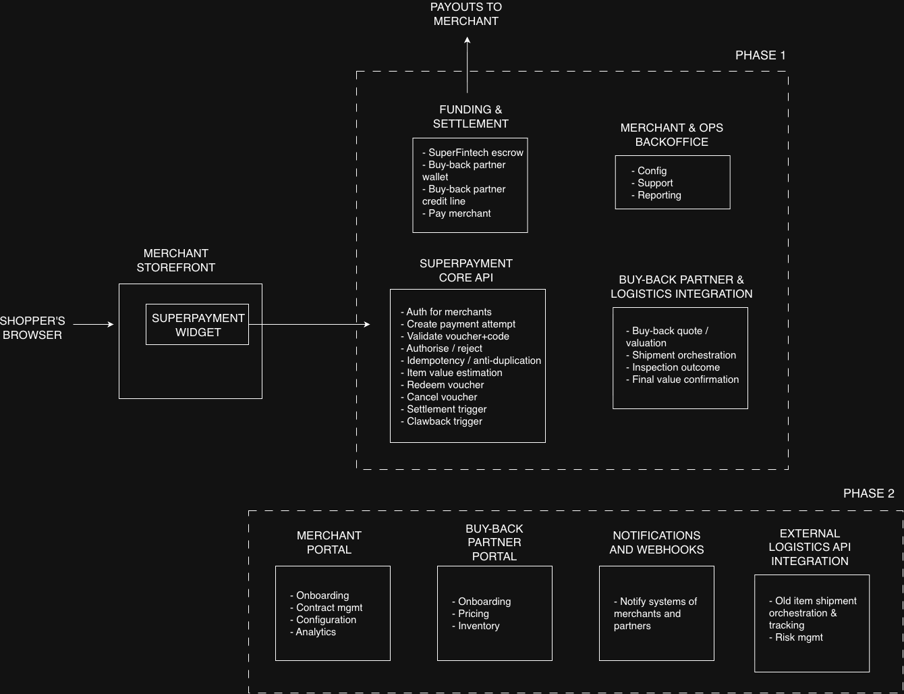

# SuperPayment

## Part 2: Design Challenge

#### 1. Invent a simple business model around the SuperPayment method, something you can describe in one sentence. It doesn’t have to be realistic but it has to explain how the money flows to make everybody happy: merchants, shoppers, and us.

In one sentence: "Buy-back partners fund vouchers by committing to purchase shoppers' used items, shoppers use those vouchers
as payment at merchant checkouts, and SuperFintech takes a commission for facilitating the transaction."

The players:
  - Shopper — wants to offset the cost of a new purchase with their old item, maybe they weren't counting on that offset
so they can buy an upgraded item model compared to the item they initially thought so they are really happy 
  - Merchant — wants to increase conversion and average order value by offering trade-in at checkout without losing margin
on the sale so they are ecstatic 
  - Buy-back partner — evaluates and buys the used item for a price that becomes the voucher, then refurbishes
and resells it at a higher price, pocketing a margin (the actual circular economy player), this player doesn't even exist in the
traditional merchant-shopper model so they are happy because the item trade-in from shoppers incentivizes their existence
  - SuperFintech — the platform connecting all three, takes a fee for facilitating, we also exist to facilitate the circular economy
between the other 3 players

The money flow: the buy-back partner assesses the old item's value and commits to purchasing it. That value becomes the
voucher. The shopper uses it as partial payment. The buy-back partner pays SuperFintech, SuperFintech settles with the
merchant (minus a commission), and the buy-back partner receives the old item to refurbish/resell.

#### 2. Design a minimal systems architecture to handle the entire business (not just the part you implemented above), good for thousands of participating merchants and hundreds of thousands of voucher operations per day. It doesn’t need to have a ton of detail, just boxes and arrows that you can present and that we can use to understand and discuss your solution. Make it complete enough that if the CEO looks at it, they think "Yes, if we build all these boxes and integrate with those external services, then we’re ready for €10M MRR". Keep it high-level (the piece you’ve built should probably not be more than one box) and avoid talking about load balancers, Kubernetes and CQRS.



- This architecture is €10M MRR-ready because:
  - Merchant Portal + e-commerce plugins = scalable merchant acquisition (thousands of merchants self-onboard)
  - Buy-back Partner Portal = multiple partners competing on pricing, better voucher values for shoppers
  - Settlement & Payments = automated money movement, no manual reconciliation
  - Logistics integration = the physical item actually gets to the buy-back partner without SuperFintech touching it
  - Notification + Webhooks = merchants and partners can integrate into their own systems

<br>

- **Important note**:
  At the beginning, SuperFintech would likely need to hold the voucher value in escrow and pay merchants right away. That’s
part of what makes the product compelling when the platform is still new and trust is low.

  To mitigate the risk of shoppers never shipping their old item or sending one in worse condition than declared, the terms
and conditions would include a clawback clause allowing SuperFintech to charge the voucher amount back to the shopper’s
card. This is what makes the escrow model sustainable from day one.

  As transaction volume grows and buy-back partners become more comfortable with the model, they can start pre-funding wallets
that voucher payments draw from. That shifts more of the capital burden away from SuperFintech.

  Later on, once partners have a solid track record, the model can move to credit lines with net settlement terms. At that point,
SuperFintech is no longer carrying as much capital risk itself and becomes more of an infrastructure and facilitation layer
earning commission, which is where the economics improve.

#### 3. You only need to be specific about one little part of the system:
- What needs to be integrated into the e-commerce platform (not limited to the checkout)? What APIs are required for that integration? No need for diagrams here.

It's needed to integrate into the e-commerce platform: 
- Product pages — show estimated trade-in value ("Trade in your old one, save up to €150")
- Cart — apply/remove voucher, show price breakdown
- Checkout — the widget (already built), voucher redemption
- Order confirmation — shipping instructions for the old item and tracking status

- APIs required:
  - GET /api/evaluations?category=phones&brand=apple&model=iphone14 — returns estimated trade-in value for product pages and
   cart
  - POST /api/vouchers — creates a voucher at checkout
  - GET /api/vouchers/{code}/validate — confirms voucher is valid, not expired, not used
  - POST /api/vouchers/{code}/redeem — locks the voucher when the order is confirmed
  - POST /api/vouchers/{code}/cancel — releases the voucher on order cancellation


#### 4. Platforms & frameworks
- What tech should we use? What should we avoid? Why? No need for diagrams here.

Use: Python/Django (already proven, strong fintech ecosystem), PostgreSQL (ACID transactions — essential for money), Redis
(caching, rate limiting), a message queue for async settlement and notifications. Keep the widget as vanilla JS to avoid
conflicts with merchant sites. Use proven payment rails like Stripe Connect or Adyen for Platforms for actual fund movement.

Avoid: Microservices too early — a monolith handles this scale fine with a small team. NoSQL for transactional data —
eventual consistency and money don't mix. Heavy JS frameworks in the widget — they'd bloat it and clash with merchant
sites.

## Part 1: Coding Challenge

#### How to run:

- Run the following to get backend and host and widget up and running:
```
make up
```

- Run backend migrations:
```
make migrate
```

- Run prestashop app:
```
make prestashop
```